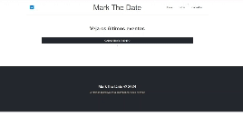

<h1 align="center">MarkTheDate</h1>

## 💻 Sobre o projeto

<p> 
MarkTheDate é um aplicativo web que permite aos usuários marcar e acompanhar eventos importantes. Com uma interface de usuário intuitiva e recursos robustos, o MarkTheDate torna o gerenciamento de eventos uma tarefa fácil e sem complicações.
É possível cadastrar eventos públicos que todos os usuários podem ver na página de dashboard e também eventos públicos que apenas será visíveis para o dono do evento.
</p>

## Pré-visualização

Aqui está uma pré-visualização do projeto em execução:



### Pré-requisitos

Ter um client-api como Postman ou Insomnia para testar os endpoints. Os endpoints estão dentro da pasta docs em backend.
Antes de começar, você vai precisar ter instalado em sua máquina as seguintes ferramentas:
[Node.js](https://nodejs.org/en/)
[VSCode](https://code.visualstudio.com/)

## Recursos

- Criar conta
- Alterar dados da conta
- Criar e gerencias eventos
- Adicionar fotos aos seus eventos
- Visualizar todos os eventos
- Visualizar eventos públicos compartilhados por outros usuários

## Tecnologias Utilizadas

O projeto foi desenvolvido utilizando as seguintes tecnologias:

- **[React](https://react.dev/)**
- **[ReactRouter](https://reactrouter.com/en/main)**
- **[Vite](https://vitejs.dev/)**
- **[Node](https://nodejs.org/en/)**
- **[Express](https://expressjs.com/pt-br/)**
- **[MongoDB](https://www.mongodb.com/pt-br)**

## Como Instalar e Executar

Primeiramente, faça um clone do repositório.

```bash
# clone o repositório
$ git clone https://github.com/WillianGiacomelli/markthedate.git
```

Altere o arquivo .env

### - Inicialize o servidor

```bash
# entre no diretório
$ cd markthedate

# entre no repositório backend
$ cd backend

# instale as dependências
$ npm install

# inicie o servidor
$ npm start
```

### - Inicialize o frontend

```bash
# entre no diretório
$ cd markthedate

# entre no repositório frontend
$ cd frontend

# instale as dependências
$ npm install

# inicie o servidor
$ npm run dev
```

## 📝 Licença

Este projeto esta sobe a licença [MIT](./LICENSE).

Feito por Willian Giacomelli 👋🏽 [Entre em contato!](https://www.linkedin.com/in/williangiacomelli/)
